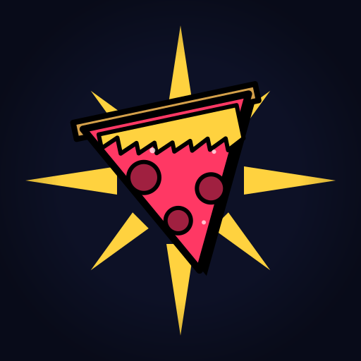

# WALLOP — Pizza Hero Gaming

A 3D bullet-heaven roguelike. You are the Pizza Delivery Hero — fight through waves
of food-themed chaos, collect upgrades, defeat three increasingly dangerous bosses,
and push through three escalating stages. Built with Three.js r128, shipping as a
static HTML5 page first, then wrapped with Capacitor for mobile.



---

## Quick start

```bash
# Serve locally (required for ES module imports)
python3 -m http.server -d src 8080
# Open: http://localhost:8080/wallop.html
```

For mobile testing on the same network:
```bash
# Visit http://<your-laptop-ip>:8080/wallop.html from your phone
```

The root `index.html` is the GitHub Pages build — identical to `src/wallop.html`
with the module path adjusted to `src/js/main.js`. Rebuild it after any change:

```bash
python3 -c "
import codecs
with codecs.open('src/wallop.html', encoding='utf-8') as f:
    c = f.read()
c = c.replace('src=\"js/main.js\"', 'src=\"src/js/main.js\"')
with codecs.open('index.html', 'w', encoding='utf-8') as f:
    f.write(c)
"
```

---

## Project structure

```
wallop/
├── CLAUDE.md                   ← Architecture briefing for Claude Code
├── README.md                   ← This file
├── index.html                  ← GitHub Pages build (auto-generated from wallop.html)
├── .claude/settings.json       ← Pre-approved Claude Code permissions
├── .gitignore
├── src/
│   ├── wallop.html             ← Game entry point (HTML shell + inline CSS + splash wiring)
│   ├── js/
│   │   ├── main.js             ← Animate loop, resize, fullscreen, context loss
│   │   ├── game.js             ← Core loop: damageEnemy, update, spawning, bosses
│   │   ├── entities.js         ← Player, enemies, projectiles, chests, gems, pools
│   │   ├── weapons.js          ← All weapon / armor / tome definitions (defWeapon etc.)
│   │   ├── upgrades.js         ← STAT_UPGRADES, SYNERGY_UPGRADES
│   │   ├── ui.js               ← HUD, level-up, armory, pause, game-over, offer gen
│   │   ├── profile.js          ← Meta-progression: Profile singleton, CATALOG, Slices
│   │   ├── state.js            ← gameState, cam
│   │   ├── config.js           ← CFG constants, STAGE_MULTS, DIFFICULTIES
│   │   ├── renderer.js         ← Three.js scene, camera, renderer, composer
│   │   ├── world.js            ← Terrain, scenery, forest ring
│   │   └── terrain.js          ← groundHeight(), resolveSolids()
│   └── splash/
│       └── pizza-hero-splash.html  ← Studio bumper (integrated)
├── assets/
│   ├── icons/icon.svg          ← 512×512 maskable app icon
│   ├── KayKit_Adventurers_2.0_FREE/   ← Character GLTF models
│   ├── KayKit_Skeletons_1.1_FREE/     ← Skeleton enemy GLTF models
│   └── KayKit_Forest_Nature_Pack_*/   ← Scenery props
└── docs/
    └── icon-preview.html
```

---

## Characters

| Character | Cost | Starter | Stat bonuses | Unique weapon | Unique armor |
|---|---|---|---|---|---|
| Pizza Hero | default | Pizza Toss 🍕 | — | Deep Dish 🍕 | Delivery Bag 🎒 |
| Frost Baker | 200 🍕 | Ice Cone 🧊 | Cold effects +50% duration | Blizzard 🌨️ | Frost Shell ❄️ |
| Oven Knight | 350 🍕 | Wallop Aura 💥 | +4 armor, +25 HP, −20% speed | Forge Hammer 🔨 | Iron Hide 🪨 |
| Crust Runner | 500 🍕 | Pepperoni Boomerang 🪃 | +35% speed, double jump, −15% cooldowns | Star Shower ⭐ | Turbo Soles 🏃 |

**Unique item unlock system:** character-exclusive items appear only in that character's
level-up pool. Other characters can unlock them cross-character: accumulate 1,500 kills
while the item is equipped, then purchase it from the Armory with Slices. Once purchased,
it appears in every character's pool permanently.

---

## Weapons (12 base + 4 char-unique + 3 slice-unlockable)

| Weapon | How to get |
|---|---|
| Pizza Toss 🍕, Wallop Aura 💥, Pizza Wheel ☸️, Thunder Strike ⚡, Ground Pound 🌀, Fireball 🔥, Pepperoni Boomerang 🪃, Ice Cone 🧊, Crossbow Bolt 🏹, Smoke Bomb 💨, Bone Staff 🦴, Calzone Bomb 🥟 | Available by default |
| Deep Dish 🍕 | Pizza Hero exclusive / 1,500 kills + 250 Slices |
| Blizzard 🌨️ | Frost Baker exclusive / 1,500 kills + 250 Slices |
| Forge Hammer 🔨 | Oven Knight exclusive / 1,500 kills + 300 Slices |
| Star Shower ⭐ | Crust Runner exclusive / 1,500 kills + 300 Slices |
| Meatball Minigun 🍝 | 150 Slices |
| Cheese Whip 🧀 | 200 Slices |
| Olive Railgun 🫒 | 300 Slices |

## Armor (6 base + 4 char-unique + 2 slice-unlockable)

| Armor | How to get |
|---|---|
| Chest Plate 🛡️, Helmet ⛑️, Kinetic Shield 💠, Vampire Amulet 🩸, Running Shoes 👟, Thorn Gauntlets 🌵 | Available by default |
| Delivery Bag 🎒 | Pizza Hero exclusive / 1,500 kills + 200 Slices |
| Frost Shell ❄️ | Frost Baker exclusive / 1,500 kills + 200 Slices |
| Iron Hide 🪨 | Oven Knight exclusive / 1,500 kills + 275 Slices |
| Turbo Soles 🏃 | Crust Runner exclusive / 1,500 kills + 250 Slices |
| Mirror Vest 🪞 | 150 Slices |
| Phoenix Apron 🔥 | 300 Slices |

## Tomes (8 base)

Tome of Power 📕, Tome of Swiftness 📒, Tome of Fortune 📗, Tome of Wisdom 📘,
Tome of Reach 📙, Tome of Warding 📓, Hunter's Tome 📔, Cursed Tome 💀

---

## Meta-progression

**Slices** 🍕 — persistent currency earned from boss kills, scaled by stage and difficulty.
Spent in the **Armory** to unlock characters, weapons, armor, and permanent run boosts.

**Permanent boosts** (Armory → Boosts tab, up to 5 levels each):
- Sharper Crust ⚔️ — +5% damage per level
- Hearty Dough ❤️ — +10 max HP per level
- Toasted Hide 🛡️ — +1 armor per level
- Quick Hands ⚡ — +5% move speed per level
- Fast Learner 📈 — +10% XP gain per level
- Coin Magnet 💰 — +10% gold gain per level
- Spare Slice 💝 — start each run with one auto-revive

---

## Stage progression

Three stages, played in sequence. Defeat the Warlord to advance.
Weapons, armor, tomes, and XP level all carry over between stages.
The player is healed 50% of max HP on each advance.

| Stage | Enemy scale | Boss HP | Boss DMG | Slice bonus |
|---|---|---|---|---|
| 1 | ×1.0 | ×1.0 | ×1.0 | ×1.0 |
| 2 | ×1.35 | ×1.5 | ×1.3 | ×1.5 |
| 3 | ×1.75 | ×2.2 | ×1.7 | ×2.5 |

Early enemies in stages 2 and 3 have a minimum strength floor that reflects the
player's accumulated power (Stage 2 floor ≈ 5-min equivalent, Stage 3 ≈ 8-min).

---

## Difficulty

| | Enemy scale | Slice bonus |
|---|---|---|
| Easy | ×0.7 | ×0.6 |
| Normal | ×1.0 | ×1.0 |
| Hard | ×1.45 | ×1.6 |
| Extreme | ×2.0 | ×2.5 |

Slice rewards are capped at ×4.0 total (stage × difficulty combined).

---

## Bosses

| Boss | Appears | HP | Gold | Slices | Special |
|---|---|---|---|---|---|
| The Sauce Slinger | 3:00 | 480 base | 25 | 5 | Arc sauce lobs with ground-ring telegraphs |
| The Hammer Chef | 6:00 | 1,200 base | 50 | 10 | Fan of 5 flying cleavers |
| The Warlord | 10:00 | 2,400 base | 100 | 15 | Homing shockwave + follow-up shot |

All bosses phase-shift at 50% HP (Enraged) and 25% HP (Desperate).
**Call the Boss**: spend 50 gold from the pause menu to skip to the Warlord immediately.

---

## Validate edits

After changing any JS module file:

```bash
python3 -c "
import codecs
with codecs.open('src/js/FILENAME.js', encoding='utf-8') as f:
    content = f.read()
with open('/tmp/check.js', 'w', encoding='utf-8') as f:
    f.write(content)
" && node --check /tmp/check.js
```

For `wallop.html` inline scripts:
```bash
python3 -c "
import re, codecs
with codecs.open('src/wallop.html', encoding='utf-8') as f:
    html = f.read()
scripts = re.findall(r'<script(?![^>]*\bsrc=)[^>]*>(.*?)</script>', html, re.DOTALL)
combined = '\n;\n'.join(scripts)
with open('/tmp/wallop_inline.js', 'w', encoding='utf-8') as f:
    f.write(combined)
" && node --check /tmp/wallop_inline.js
```

**Critical lint checks:**
- `grep -c 'scene\.remove(' src/wallop.html` → must be 0 (use `killMesh()`)
- `grep -c 'MeshLambertMaterial' src/wallop.html` → must be 0 (use `flatPhong()` / `smoothPhong()`)

---

## Working with Claude Code

```bash
npm install -g @anthropic-ai/claude-code
claude
```

First prompt: **"Read CLAUDE.md and confirm you understand the project's constraints."**

`CLAUDE.md` has the full architectural briefing — major systems, critical gotchas
(GPU leak prevention, material rules, pointer lock, mobile concerns), and conventions.

---

## Roadmap

- Capacitor wrapper for Google Play Store launch
- AdMob integration (rewarded-ad reroll already wired with simulation)
- Tome of Echoes and Tome of Time implementations
- iOS build
- Procedurally varied arena biomes / stage themes

---

## License

TBD — depends on distribution plans (Play Store, Steam, etc.).
